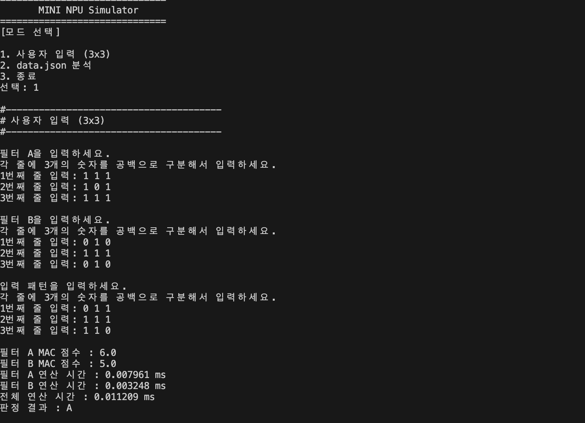
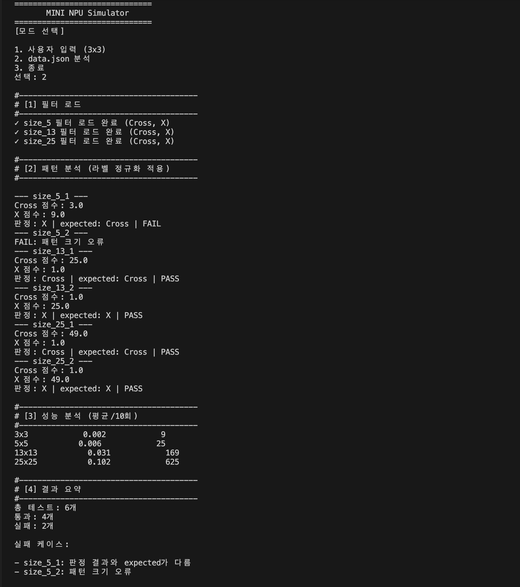

# 1. 과제 설명
AI의 Mac 연산을 작은 규모로 구현해보고, 아래 항목에 대해 파악할 수 있다

- MAC(Multiply-Accumulate) 연산이 무엇이고, AI에서 왜 중요한지 설명할 수 있다.
- 입력 패턴과 필터를 곱하고 더해서 유사도(점수)를 계산하는 원리를 설명할 수 있다.
data.json의 “키 규칙/라벨 규칙”을 해석하고, 프로그램 내부에서 라벨을 표준화(정규화)하는 이유를 설명할 수 있다.
- 부동소수점 오차가 판정에 어떤 영향을 주는지, 그리고 허용오차(epsilon) 기반 비교 정책이 필요한 이유를 설명할 수 있다.
- 크기별 연산 시간을 측정하고, 패턴 크기 증가에 따른 시간 복잡도 O(N²)를 근거와 함께 설명할 수 있다.
- 실패 케이스가 발생했을 때 원인을 “데이터/스키마 문제 vs 로직 문제 vs 수치 비교 문제”로 분리해 진단하고 개선할 수 있다.

# 2. 실행 방법
## (1) 개발 환경
- python 버전 : 3.12.13
- 외부 라이브러리 설치하지 않고 표준 라이브러리만 사용 (json, time)
## (2) 실행 시 필요 자료 
- 데이터 검증용 필터와 테스트 데이터가 저장된 data.json 파일
- 프로그램 코드가 있는 main.py 파일
## (3) 참고 지식
### 1) MAC 연산
- 두 배열을 겹쳐서 같은 위치의 숫자끼리 곱한 후 그 결과를 모두 더하는 과정을 의미
- 동일한 사이즈의 2차원 배열로 정리된 필터와 동일한 사이즈의 테스트 데이터 배열을 곱할 때 필터의 가중치에 따라 유사도가 결정되며, 값이 높을 수록 해당 필터에 가깝다고 판정을 내린다.
### 2) 허용오차 기반 비교 정책
- 연산값이 0.5 라고 가정할 때, 실제 그 값은 0.49 일수도 있고, 0.5 일수도 있다. 이런 경우 실제 2개의 값은 같지만 2개 값을 비교할 경우 작은 차이로 패턴의 값이 결정되는 결과를 낳을 수 있으므로, 이런 판정을 방지하기 위해 epsilon 정책을 적용하여 동점을 처리한다.
### 3)json 파일의 정규화(라벨링) 
- 필터가 갖는 정답이 모두 같은 규칙을 가지고 작성되지 않았을 수 있으므로 동일한 규칙을 적용해서 통일된 값을 표현하도록 정리한다.
- 키의 경우 필터 패턴과 테스트용 데이터의 패턴이 동일한지 확인할 수 있도록 규칙에 따라 키값이 패턴을 나타낼 수 있도록 정리한다. 
### 4) 시간복잡도 : O(N²)
- 입력 크기가 n배 증가 → 실행 시간은 n² 배 증가 하는 것을 뜻한다.
- 패턴 크기가 증가할수록 연산 시간도 증가하게 된다. 특히 2차원 배열이므로 사이즈가 늘어날 경우 실제 처리해야 할 작업의 수는 제곱의 수 만큼 늘어나게 되므로 기존 방식으로는 직렬 연산만 가능하므로 시간이 오래걸릴 수 밖에 없다.
- 만약 병렬처리가 가능하다면 그만큼 시간복잡도는 떨어지게 된다.
## (4) 2가지 실행 방법
### 1) 사용자 입력 방식
- 3x3 구조로 사용자의 입력값을 받아서 필터와 패턴을 생성한다
- 프로그램은 필터와 패턴을 가지고 MAC 연산을 한 뒤 결과를 보여준다. 만약 결과 차이가 epsilon 보다 작으면 판정 불가(undecied) 로 처리한다.
### 2) 자동 분석 방식
- json 파일에는 필터와 테스트용 패턴 데이터 2가지 종류가 존재한다.
- 패턴 데이터는 사이즈별로 2개씩 존재하며, 정답도 함께 제공된다.
- 프로그램을 실행하면 필터를 확인하고 각 패턴별로 어떤 사이즈인지 확인 후 맞는 필터를 선택해서 MAC 계산을 한다.
- 결과값이 정답과 일치하면 pass, 틀리면 fail을 반환한다.

# 3. 구현 요약
- 이 시뮬레이터는 mac 연산을 파이선으로 간단히 구현한 프로그램이다.
- 이 시뮬레이터에서는 cross, x 2개의 필터를 사용해서 테스트 대상 패턴이 어느 필터에 가까운 형태인지 판정하는데, 모드 1에서는 3×3 사이즈/사용자 직접 입력 방식을 적용해서 2개의 필터 중 1개를 판정 결과로 출력하거나 동점일 경우 판정 불가의 결과를 출력하도록 한다. 모드 2의 경우 대용량 데이터를 작업할 때 적용할 수 있는 방법으로, 다양한 사이즈의 필터와 필터의 값, 그리고 테스트 데이터 패턴을 json 파일에 저장하여 패턴이 어떤 정답에 가까운지 출력하고, 만약 동점이 나올경우 undicided 를 출력하도록 한다.
- 판정 불가/undicided 를 판정할 때 허용오차기반 정책을 적용해서 동점을 판단한다.
- json 파일의 필터 라벨의 경우 규칙성을 갖고 작성되지 않았을 가능성이 있으므로 정규화 작업 해주고, 이 작업은 매서드로 작성하여 필요할 때 마다 호출해서 사용할 수 있도록 한다.
- 패턴의 사이즈가 커지면 계산량도 증가하고, 이와 더불어 시간복잡도 역시 증가한다. 시간복잡도의 경향을 파악하기 위해 최소 10번 정도의 테스트를 수행한 결과값을 평가 결과로 출력하며, 이 시간복잡도로 인해 패턴의 사이즈가 커질 경우 병렬 처리의 필요성을 알 수 있다.ss

# 4. 결과 리포트
## (1) 사용자 입력(3x3) 실행
### 1) 성공 케이스
- 2개의 필터를 생성하고, 1개의 패턴을 입력하여 어느 케이스애 가까운지 결과값을 보여준다.

### 2) 실패 케이스
- 필터와 패턴 모두 동일한 값을 가질 때 MAC 계산에서 차이를 가지지 못하므로 '판정 불가' 로 차리된다.

## (2) data.json 분석 실행
### 1) Pass 처리
- 테스트 데이터 별로 정답이 존재하고, json 파일로부터 읽어온 필터를 통해 MAC 계산을 했을 때 정답과 일치하면 pass 로 처리한다.
### 2) Fail 처리
- MAC 연산의 결과와 정답이 다를 경우 expected 와 다르다는 설명과 함께 Fail로 처리
- 필터 사이즈와 테스트 데이터의 사이즈가 다를 경우 크기가 다르다는 오류 안내

### 3) 시간 복잡도 분석
- MAC 연산은 N×N 크기의 패턴과 필터에서 모든 위치의 값을 곱하고 누적해야 한다. 따라서 한 변의 크기가 N일 때 총 N²개의 위치를 처리해야 한다. 실제 측정에서도 연산 위치 수가 증가하는 비율과 실행 시간이 증가하는 비율이 비슷하게 나타났으며, 이를 통해 MAC 연산의 시간복잡도가 O(N²)에 가까운 특성을 가진다는 것을 확인할 수 있었다.
- 하지만 시간 비율과 N² 배율이 정확히 똑같아야 함을 의미하지는 않는다. 시간 복잡도는 정확히 몇 시간이 걸린다 라는 것을 알려주는 개념이 아니라 N이 커질 때 필요한 작업량이 어떻게 증가하는지를 나타내는 개념이므로 반드시 배율과 시간의 증가량이 동일해야 함을 의미하지는 않는다.
- 또한 시간복잡도는 시간 측정 오차가 발생할 가능성도 있고, CPU에 따라서 달라질 수도 있으며, 다른 작업이 진행되고 있을 경우도 있으므로 이같은 상황에 시간 복잡도는 영향을 받을 수 있다는 점도 고려해야 한다.

- 계산량이 늘어날 때 실제 실행 시간도 비슷한 배수로 늘어났을지를 확인하기 위해 아래의 계산을 참고하면 된다.

#### < 3x3 → 5x5 >
#### size_ratio_1 = 25(5²) / 9(3²)          = 2.78
#### time_ratio_1 = 0.005 / 0.002           = 2.5 (거의 같음)

#### < 5x5 → 13x13 >
#### size_ratio_2 = 169(13²) / 25(5²)       = 6.76
#### time_ratio_2 = 0.029 / 0.005           = 5.8 (거의 같음)

#### < 13x13 → 25x25 >
#### size_ratio_3 = 625(25²) / 169(13²)     = 3.70
#### time_ratio_3 = 0.105 / 0.029           = 3.62 (거의 같음)

