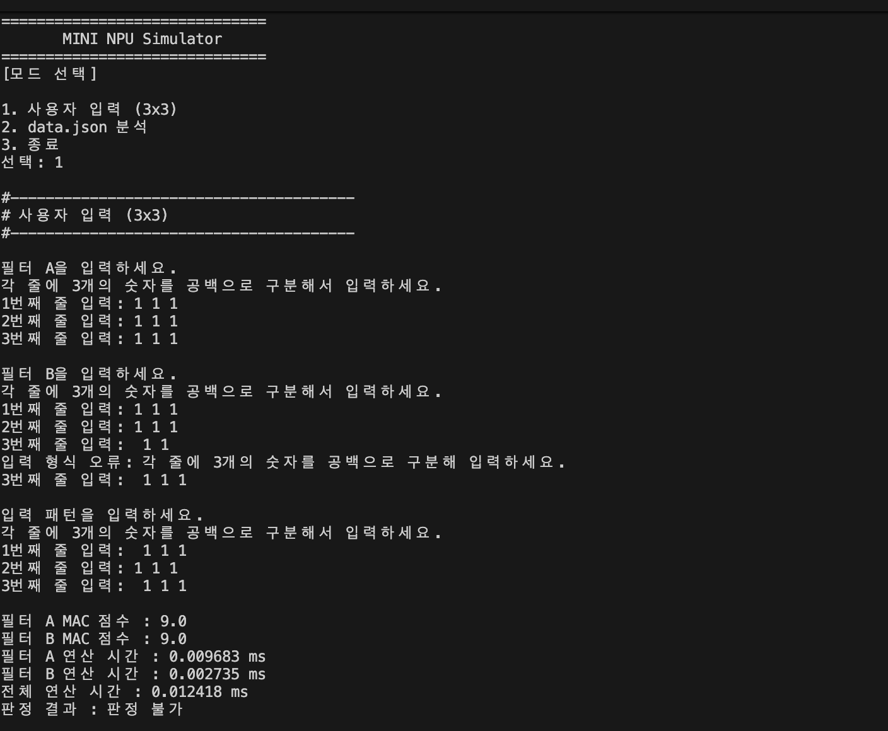
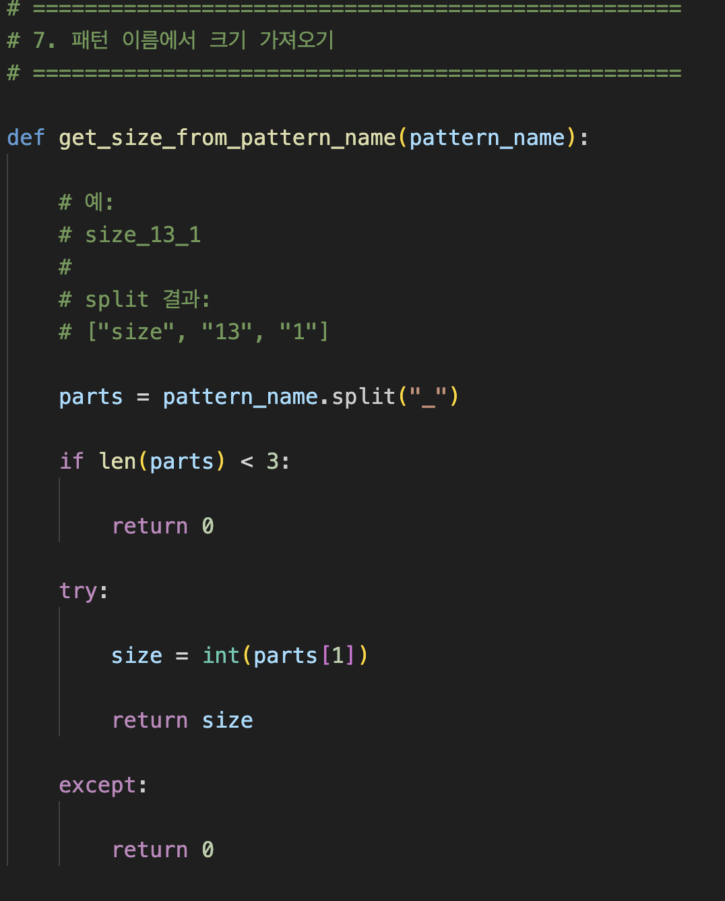
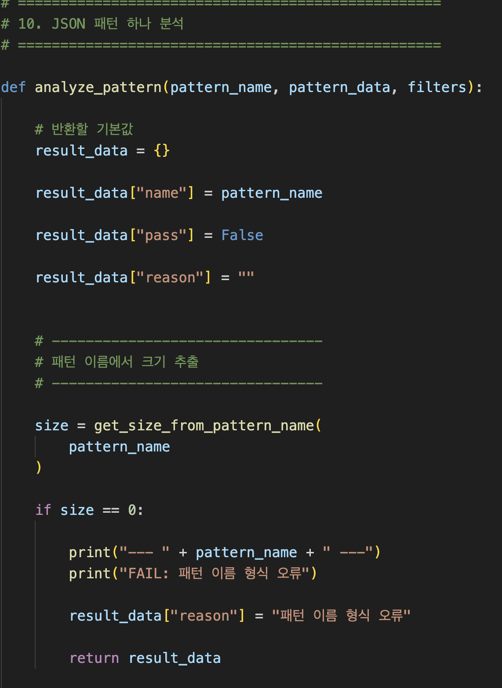
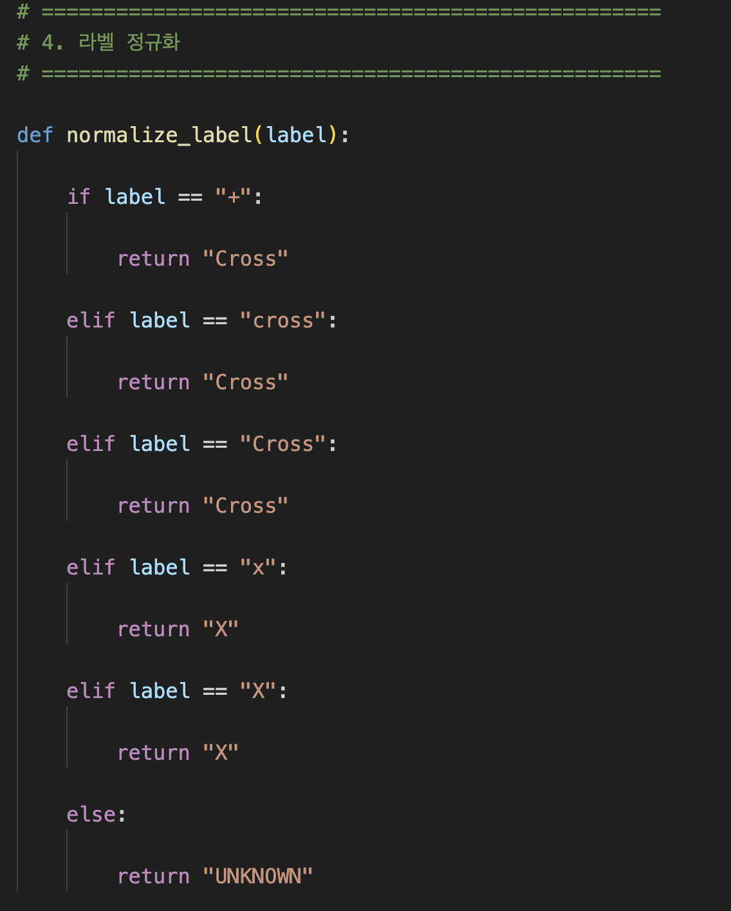
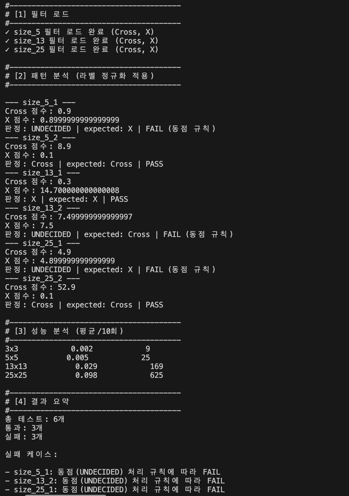
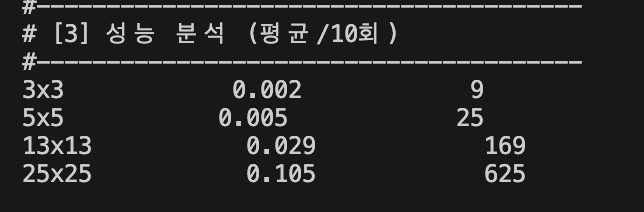
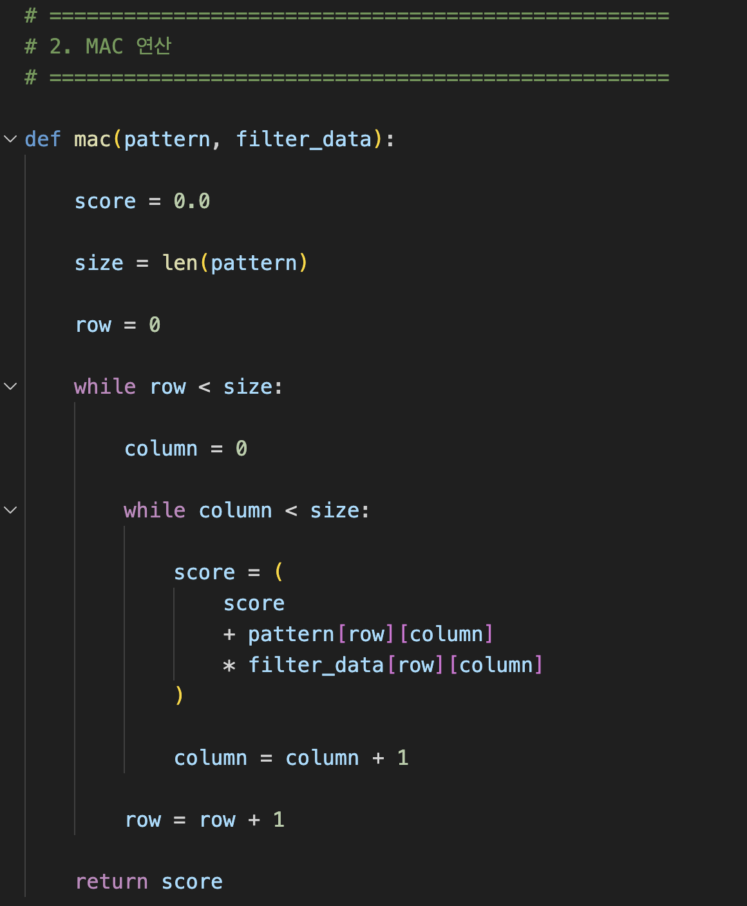
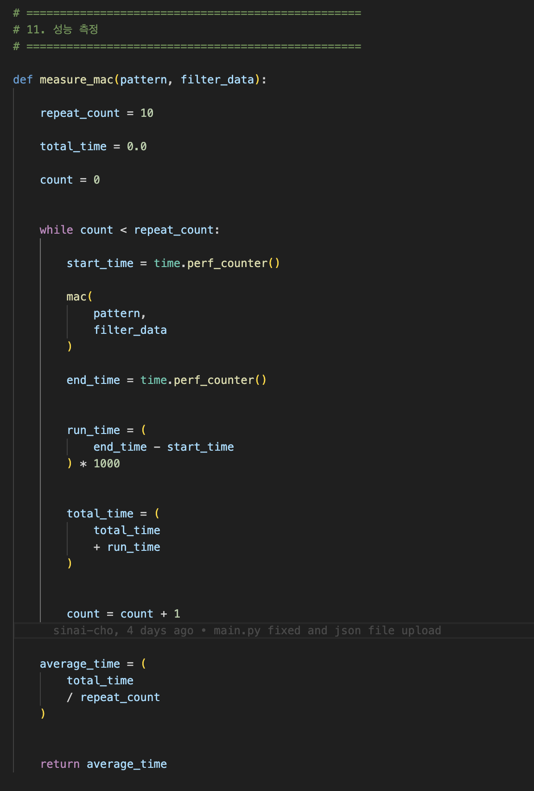

## 1. 판정불가, 입력 오류 에러

## 2. 모드 2에서 사이즈 일치시키는 로직

## 3. 표준라벨 정규화 로직

## 4. 동점 발생시 undecided 출력 및 faiㅣ 처리

## 5. 성능분석표 크기별로 시간과 연산 회수

# =======================================

## 6. 맥 연산 로직 흐릅(입력, 곱셈, 누적합산, 점수 반환) 을 코드 구조 기준으로 설명

### 1) 입력
- 2개의 데이터를 받는다
#### mac(pattern, filter_data)
#### pattern = 검사할 데이터
#### filter_data = 비교 기준이 되는 필터
### 2) 같은 위치끼리 곱셈
- pattern[row][column] * filter_data[row][column]
### 3) 결과 더하기
- score = score + 곱셈결과
### 4) 최종 점수 반환
- return score

## 7. 패턴키에서 크기(n) 추출해서 필터의 사이즈_n 과 매칭하는 로직 설명

## 8. 라벨 정규화를 별도 함수로 분리한 이유와 장점
- 여러 곳에서 같은 함수를 반복 하는 것을 방지한다. 필터를 가져올 때 마다 정규화 작업 코드를 작성하기보다, 함수로 만들어 둔 것을 호출해서 사용하는 것이 훨씬 편리하다.

## 9. 시간 측정시 입출력을 배제하고 연산 구간으르 측정하기 위해 어떤 경계를 잡았는가?
- mac 연산 시간만 연산 구간으로 측정하고, 해당 프로세스 전체 수행시간을 연산 구간으로 정하지 않았다.
- 만약 전체 수행 시간을 연산 구간으로 지정한다면, json 파일을 읽어오는 시간이나, 선택 시간 등도 포함되어 mac의 성능만을 보기 어렵다.

# ======================================

## 10. 맥 점수가 높을수록 더 유사하다고 판단할 수 있나?
- 이번 테스트에서는 그렇다고 볼 수 있다. 하지만 모든 mac 연산에서는 그렇다고 보기 어려울 것 같다.

## 11. 시간 분석도에 대한 설명
- 연산당 1초의 시간이 걸린다고 가정한다면, 3×3 패턴을 연산할 때 총 9번의 연산을 수행하므로, 시간은 N² 만큼 증가하는 경향을 보인다고 할 수 있다.

## 12. 부동소수점 오차 발생 원인과 비교정칙 필요성
- 미세한 결과값은 언제나 존재한다. (수학에서 극한의 개념처럼) 0.9 라는 숫자가 있다고 가정할 때 이 숫자는 0.0000000089 일수도 있고, 0.0000000009 일 수도 있다. 이 미세한 차이로 측정 결과를 정한다면 너무 단순하게 결과가 나오므로 허용오차(epsion)
을 사용하여 동점 처리를 하게 된다.

## 13. 동점처리규칙을 모드 1,2 따로 둔 이유를 요구사항 관점에서 설명
- 모드 1,2 모두 동점 처리 규칙은 epsilone을 적용하고 있지만 표현방법이 다르다. 1번은 정답이 존재하지 않으므로 pass/fail 로 처리할 필요가 없는 반면(a, b, 핀정불가) 2번은 정답이 존재하므로 undecided/pass/fail 로 처리한다. 

# =======================================

## 14. 제이슨 파일에 새로운 라벨이 추가된다면 정규화, 판정, 출력, 테스트를 어떤 순서로 확장할지 설명
- 우선 기존 제이슨 파일의 필터에 새로운 라벨을 추가한다. 그리고 해당 라벨에 대한 테스트 문제로 추가한다.
- 그 후 라벨 함수에 정규화 규칙을 추가한다.
- 기존의 cross/x로만 판단했던 판정 로직을 새로운 라벨이 추가되었을 때 어떤 필터의 점수가 가장 높은지에 대한 판정 로직으로 수정해야 한다.
- 출력의 경우도 기존 cross/x만 보여주던 결과에 새로운 라벨 점수를 보여주는 것으로 수정해야 한다.
- 최후로 추가된 라벨과 수정한 로직이 제대로 동작하는지 테스트해서 제대로 나오는지 확인해야 한다

## 15. 1000/1000 패턴을 처리한다면 시간과 메모리 측면에서 어떤 문제 발생하며, 어떤 최적화를 우선 적용해볼까?
- 연산 대상이 늘어나므로 당연히 수행 시간이 많이 걸린다.
- 또한 연산할 대상이 엄청나게 늘어나므로 연산에 사용할 메모리 뿐 아니라, 파일을 파이선으로 변경하는 작업에 소요되는 메모리 등도 고려해야 하므로 이럴 경우 우선적으로는 병렬처리가 가능한 장치(npu) 같은 도구를 사용하는 것을 고려해야 한다.

## 16. cpu의 직렬처리와 npu의 병렬처리 관점에서 맥연산의 병목이 어디에 생길 수 있는가?
- 병목이란 전체 작업 속도를 가자아 크게 제한하는 부분을 뜻한다.
- 직렬처리의 경우 앞선 경우와 같이 패턴 크기가 커진다면 